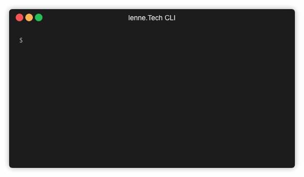

# lt CLI

A CLI for [lenne.Tech](https://github.com/lenneTech) libraries and frameworks.

CLI in action:



[](/LICENSE) [](https://circleci.com/gh/lenneTech/cli/tree/master)
[](https://david-dm.org/lenneTech/cli) [](https://david-dm.org/lenneTech/cli?type=dev)

<!--
[](https://github.com/lenneTech/cli/fork) [](https://github.com/lenneTech/cli)
-->

## Installation

```
$ npm install -g @lenne.tech/cli
```

## Usage

```
Menu mode
$ lt
or command line mode
$ lt <command> (<subcommand>) (<parameter>)
```

## Help / List of commands

```
$ lt help
or
$ lt
```

## Documentation

- [Command Reference](docs/commands.md) - Complete list of all commands with options
- [Configuration Guide](docs/lt.config.md) - Configuration file documentation
- [Plugin Guide](docs/plugins.md) - How to create plugins

## Configuration

The CLI supports project-specific configuration via `lt.config` files. This allows you to set default values for commands, reducing repetitive input.

```bash
# Create a configuration file interactively
$ lt config init

# Show current configuration (merged from hierarchy)
$ lt config show
```

Supported formats:
- `lt.config.json` - JSON format (recommended)
- `lt.config.yaml` - YAML format
- `lt.config` - Auto-detected format

Configuration files are searched from the current directory up to root and merged hierarchically.

For detailed documentation, see [docs/lt.config.md](docs/lt.config.md).

## Examples

```
// Start
$ lt

// Create new server
$ lt server create <ServerName>
or
$ lt server c <ServerName>

// Create new module for server (in server project root dir)
$ lt server module <ModuleName>
or
$ lt server m <ModuleName>

// Update and install npm packages (in project dir)
$ lt npm update
or
$ lt npm up
or
$ lt npm u

// Checkout git branch and update packages (in project dir)
$ lt git get <branch-name or part-of-branch-name>
or
$ lt git g <branch-name or part-of-branch-name>

...

```

## Development

```
# Clone project
git clone git@github.com:lenneTech/cli.git
cd cli

# Link the project for global usage
npm link

# Make changes
...

# Test changes
lt ...

# Build new version
npm build
```

## Thanks

Many thanks to the developers of [Glugun](https://infinitered.github.io/gluegun)
and all the developers whose packages are used here.

## License

MIT - see LICENSE
