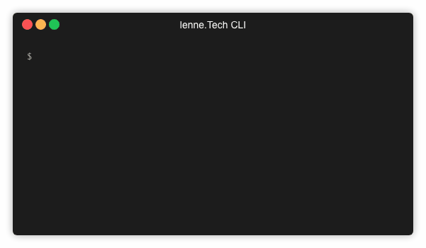

# lt CLI

A CLI for [lenne.Tech](https://github.com/lenneTech) libraries and frameworks.

CLI in action:



[](/LICENSE) [](https://circleci.com/gh/lenneTech/cli/tree/master)
[](https://david-dm.org/lenneTech/cli) [](https://david-dm.org/lenneTech/cli?type=dev)

<!--
[](https://github.com/lenneTech/cli/fork) [](https://github.com/lenneTech/cli)
-->

## Installation

```
$ npm install -g @lenne.tech/cli
```

## Usage

```
Menu mode
$ lt
or command line mode
$ lt <command> (<subcommand>) (<parameter>)
```

## Help / List of commands

```
$ lt help
or
$ lt
```

## Documentation

- **[LT-ECOSYSTEM-GUIDE](docs/LT-ECOSYSTEM-GUIDE.md)** — Complete reference for `lt` CLI **and** the `lt-dev` Claude-Code Plugin (architecture, functions, vendor-mode workflows, agents, skills)
- **[VENDOR-MODE-WORKFLOW](docs/VENDOR-MODE-WORKFLOW.md)** — Step-by-step guide for npm → vendor conversion, updates, and rollback
- [Command Reference](docs/commands.md) — Complete list of all commands with options
- [Configuration Guide](docs/lt.config.md) — Configuration file documentation
- [Plugin Guide](docs/plugins.md) — How to create plugins

## Quick Start

```bash
# Check your environment
$ lt doctor

# Show project status
$ lt status

# Enable shell completions
$ lt completion install
```

## Framework consumption modes (nest-server)

When you create a new api project (`lt fullstack init` or `lt server create`),
the CLI supports two framework consumption modes:

**`npm` mode (default)** — `@lenne.tech/nest-server` is installed as an npm
dependency. Framework source lives in `node_modules/@lenne.tech/nest-server/`.
Imports use the bare specifier `from '@lenne.tech/nest-server'`. Update path:
`/lt-dev:backend:update-nest-server` (Claude Code agent).

**`vendor` mode** — The framework's `core/` directory is copied directly into
`<api>/src/core/` as first-class project code. No `@lenne.tech/nest-server`
npm dependency. Generated imports use relative paths (`from '../../../core'`).
Local patches are allowed and tracked in `src/core/VENDOR.md`. Update path:
`/lt-dev:backend:update-nest-server-core` (Claude Code agent).

### Creating projects

```bash
# npm mode (classic, default)
$ lt fullstack init --name myapp --frontend nuxt --api-mode Rest

# vendor mode, HEAD of upstream
$ lt fullstack init --name myapp --frontend nuxt --api-mode Rest \
    --framework-mode vendor

# vendor mode, pinned to a specific upstream branch or tag
$ lt fullstack init --name myapp --framework-mode vendor \
    --framework-upstream-branch 11.24.1

# dry-run: print the plan without touching the filesystem
$ lt fullstack init --name myapp --framework-mode vendor --dry-run --noConfirm

# standalone api project (vendor mode works here too)
$ lt server create --name myapp --framework-mode vendor
```

### Experimental: `--next` (nest-base)

Both `lt fullstack init` and `lt server create` support an experimental
`--next` flag that swaps the API template from
[`nest-server-starter`](https://github.com/lenneTech/nest-server-starter)
(MongoDB) to [`nest-base`](https://github.com/lenneTech/nest-base) — a new
NestJS stack on **Bun + Prisma 7 + Postgres + Better-Auth** with a built-in
`/dev` cockpit.

```bash
# experimental standalone api
$ lt server create my-next-api --next --noConfirm

# experimental fullstack (nuxt + nest-base)
$ lt fullstack init --name my-next-app --frontend nuxt --next --noConfirm
```

When `--next` is set the CLI:

- clones `nest-base` instead of `nest-server-starter`,
- forces `--api-mode Rest` and `--framework-mode npm` (other modes are not
  applicable to nest-base),
- skips `nest-server-starter`-specific patching (`config.env.ts`,
  `main.ts` Swagger setup, `meta.json`, `lt.config.json`),
- skips the workspace install in fullstack mode — run `pnpm install` for
  the frontend and `bun install` for the API yourself.

This option is **experimental** and may change. The downstream `lt server
module/object/addProp/test/permissions` commands target the classic
`nest-server` layout and are not yet compatible with `nest-base`.

### Working on an existing project

All `lt server …` commands (module, object, addProp, test, permissions)
**auto-detect** the framework mode via `src/core/VENDOR.md` and generate
the correct import syntax automatically. You never pass `--framework-mode`
after `init`; it is persisted in the project's `lt.config.json`.

```bash
# inside projects/api — generates relative or bare imports automatically
$ lt server module --name Product --controller Rest

# shows the mode + project type
$ lt status

# prints the mode-specific update instructions
$ lt fullstack update
```

### Vendor-mode housekeeping

Vendor-mode projects ship three maintenance scripts under `scripts/vendor/`:

| Script | Purpose | Invocation |
|---|---|---|
| `check-vendor-freshness.mjs` | Non-blocking warning when upstream has a newer release than the current baseline | `pnpm run check:vendor-freshness` (auto-invoked by `pnpm run check` / `check:fix` / `check:naf`) |
| `sync-from-upstream.ts` | Diff generator consumed by the `nest-server-core-updater` Claude Code agent | `pnpm run vendor:sync` |
| `propose-upstream-pr.ts` | Patch-list generator consumed by the `nest-server-core-contributor` agent | `pnpm run vendor:propose-upstream` |

The vendor-mode baseline (upstream version + commit SHA) is recorded in
`src/core/VENDOR.md`. Log any substantial local patch there so the updater
agent can classify it at sync time.

### Integration test

A full end-to-end smoke test for all four supported init combinations
(`npm/Rest`, `vendor/Rest`, `vendor/GraphQL`, `vendor/Both`) ships with the
CLI:

```bash
$ pnpm run test:vendor-init
```

Each scenario runs init → module → object → addProp → test → tsc → build →
migrate:list and asserts ~30 structural + functional invariants per scenario.
Run this before releasing a new CLI version to catch upstream drift early.

## Configuration

The CLI supports project-specific configuration via `lt.config` files. This allows you to set default values for commands, reducing repetitive input.

```bash
# Create a configuration file interactively
$ lt config init

# Show current configuration (merged from hierarchy)
$ lt config show
```

Supported formats:
- `lt.config.json` - JSON format (recommended)
- `lt.config.yaml` - YAML format
- `lt.config` - Auto-detected format

Configuration files are searched from the current directory up to root and merged hierarchically.

For detailed documentation, see [docs/lt.config.md](docs/lt.config.md).

## Examples

```
// Start
$ lt

// Create new server
$ lt server create <ServerName>
or
$ lt server c <ServerName>

// Create new module for server (in server project root dir)
$ lt server module <ModuleName>
or
$ lt server m <ModuleName>

// Update and install npm packages (in project dir)
$ lt npm update
or
$ lt npm up
or
$ lt npm u

// Checkout git branch and update packages (in project dir)
$ lt git get <branch-name or part-of-branch-name>
or
$ lt git g <branch-name or part-of-branch-name>

// Preview what a command would do (dry-run)
$ lt git clear --dry-run
$ lt git reset --dry-run
$ lt git squash --dry-run
$ lt git rebase --dry-run

// Skip confirmation prompts (noConfirm)
$ lt git get feature --noConfirm
$ lt git squash dev --noConfirm

// Combine flags for CI/CD pipelines
$ lt git clean --noConfirm
$ lt server module User --noConfirm

// View command history
$ lt history

...

```

## Development

```
# Clone project
git clone git@github.com:lenneTech/cli.git
cd cli

# Link the project for global usage
npm link

# Make changes
...

# Test changes
lt ...

# Build new version
npm build
```

## Thanks

Many thanks to the developers of [Glugun](https://infinitered.github.io/gluegun)
and all the developers whose packages are used here.

## License

MIT - see LICENSE
